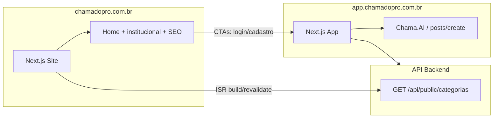

# Arquitetura — Site vs aplicativo

**Última atualização:** setembro/2026

## Visão geral



## Separação SEO (site × app)

| Propriedade | Papel |
|-------------|--------|
| `chamadopro.com.br` | SEO público (serviços, conteúdo, conversão) |
| `app.chamadopro.com.br` | Aplicativo (login, pedidos, painéis) — **não** compete por buscas de serviço |

No app (`chamadopro/social` → `frontend`):
- metadata raiz com `robots: noindex, follow`
- `src/app/robots.ts` bloqueia áreas autenticadas/técnicas
- páginas legais mantêm `index: true`
- sem sitemap de serviços no app

O site institucional concentra o sitemap e as páginas indexáveis de especialidades.

## Regra de produto (obrigatória)

1. O visitante **navega** no site (conteúdo, categorias, FAQ).
2. Para **solicitar serviço**, deve **entrar ou cadastrar-se no app**.
3. Após autenticação, o pedido é publicado no fluxo **Chama.AI**: `/posts/create?fluxo=chama-ai`.

O site nunca simula formulário de pedido nem processa pagamento.

## Fluxo do visitante

```
Site → botão "Entrar" ou "Cadastrar-se"
     → app.chamadopro.com.br/login ou /register-cliente
     → usuário autenticado
     → /posts/create?fluxo=chama-ai (pedido no sistema)
```

CTAs com intenção explícita de pedido usam `entrarParaPedirServico()` em `src/config/appLinks.ts` (login com `redirect` para o Chama.AI).

## Estrutura do código

```
chamadopro_site/
├── docs/                 # Esta documentação
├── public/               # assets estáticos (logo, imagens)
├── src/
│   ├── app/              # Rotas Next.js (inclui robots.ts, sitemap.ts, /servicos/[slug])
│   ├── components/       # UI compartilhada
│   ├── config/appLinks.ts
│   └── lib/catalog.ts    # Catálogo + fetch API
├── .env.example
└── package.json
```

## Branches Git

| Branch | Uso |
|--------|-----|
| `develop` | Desenvolvimento diário |
| `main` | Produção (`chamadopro.com.br`) |

Fluxo: `develop` → merge/PR → `main` → deploy.

## Integração com o monorepo `social`

O site consome apenas endpoints **públicos** da API:

- `GET /api/public/categorias` — catálogo para páginas SEO
- (futuro) `GET /api/public/parceiros`, `GET /api/config/branding`

Alterações de catálogo no backend (`backend/src/config/catalogoCategoriasEspecialidades.ts`) devem ser refletidas em `src/lib/catalog.ts` até existir sincronização automática.
